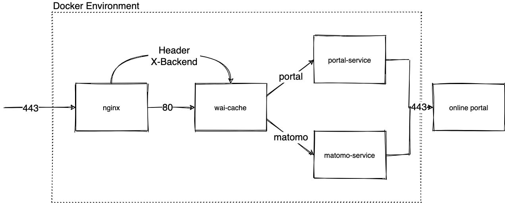

# WAI-Cache

The wai-cache module aims to speed up matomo widget visualization using varnish  http accelerator: vcl configuration is located [here](containers/wai-cache/varnish/default.vcl).

## Development Environment

To test the varsnish configuration there is a docker-compose environment that simulates the production environment.
Create the PKI to avoid browser alerts:
```bash
$ cd containers/wai-cache/nginx
$ openssl genrsa -des3 -out dev-CA.key 2048 
$ openssl req -x509 -new -nodes -key dev-CA.key -sha256 -days 1024  -out dev-CA.pem -subj '/CN=WAI Dev CA/O=AgID/OU=DEV/C=IT'
$ openssl req -new -nodes -out server.csr -newkey rsa:2048 -keyout server.key -subj '/CN=webanalytics.italia.it/O=AgID/OU=DEV/C=IT'
$ openssl x509 -req -in server.csr -CA dev-CA.pem -CAkey dev-CA.key -CAcreateserial -out server.crt -days 500 -sha256 -extfile v3.ext
$ cat server.crt dev-CA.pem > chain.pem
$ cd ../../..
```
- Trust the development certification authority located in `containers/wai-cache/nginx/dev-ca.pem`
- Add `127.0.0.1 webanalytics.italia.it` entry to the hosts file
- Ensure that no process is listening to tcp port 443

go to the containers folder and:
```bash
$ docker-compose -f docker-compose-cache.yaml up
```
Once containers are up click [here](https://webanalytics.italia.it).



## Deployment

To deploy the solution we use ansible, run the command
```bash
$ cd playbooks
$ ansible-playbook -i inventory/hosts.ini --tags deploy deployment.yml
```

If you just want to create deployment file execute the command below (file will be stored in playbooks/compiled-templates).
```bash
$ cd playbooks
$ ansible-playbook -i inventory/hosts.ini --tags templates deployment.yml
```
